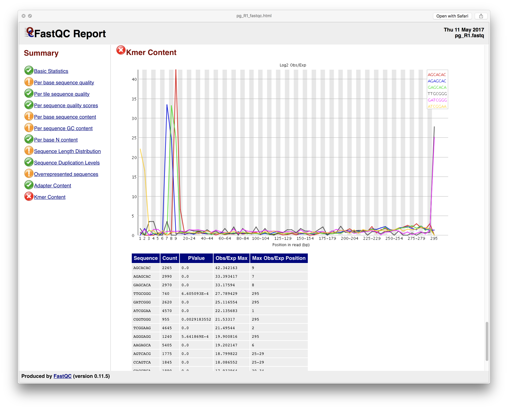

#Fundamentos de ensamblaje de genomas, expresión génica, metagenómica. 
Insertar clase para el lalo

#Preprocesamiento de datos propios, Control de calidad. Análisis básicos en R

En este práctico aprenderemos los pasos esenciales que se deben realizar para obtener un buen ensamble a partir de lecturas de una secuenciación (reads), se debe tener en cuenta que mientras más buena sea una secuenciación, mejor será su ensamble.

###Paso 1: Revisar calidad de los reads

El primer paso (siempre), en el tratamiento de reads es revisar su calidad, para esto usaremos FastQC, un programa escrito en java y que rapidamente nos puede otorgar estadisticas acerca del estado de nuestros reads.

	Abrir fastQC.
	File -> Open -> seleccionar nuestros reads.

La principal ventana que nos interesa es la calidad que tiene nuestra secuenciación, y en general, una calidad (Q) sobre 20 se considera buena.

El %GC lo usamos para corroborar que lo que se secuenció sea efectivamente lo que queremos, para eso, ambas curvas (teórica y real), deben ser similares.

Al principio y al final de nuestros reads se nota un aumento en la frecuencia de k-mers (errores de secuenciación?)

Para todas estas correcciones, usaremos "prinseq"

###Paso 2: Control de calidad
Directo al grano
	
	perl prinseq-lite -fastq pg_R1.fastq -fastq2 pg_R2.fastq -out_good pass -out_bad null -trim_left 10 -trim_right 20 -trim_qual_right 20 -min_len 75 -trim_qual_window 15  -trim_qual_step 5 -ns_max_n 0

Donde:

* -fastq es el nombre del primer archivo fastq.
* -fastq2 es el nombre del segundo archivo fastq.
* -out\_good imprime solo las secuencias que pasan el control de calidad que se ha establecido.
* -out\_bad imprime las secuencias que no pasaron el control de calidad, como en este es null, no se imprimiran).
* -trim\_left corta N bases a la izquierda de la secuencia.
* -trim\_right corta N bases a la derecha de la secuencia
* -trim\_qual\_right corta bases a la derecha hazta que se encuentre con una calidad superior a la especificada.
* -min_len filtra las reads por un tamaño N
* -trim\_qual\_window es el numero de bases en los que se trabajará para revisar la calidad 
* -trim\_qual\_step cuantas bases avanzara la ventana de trim\_qual\_windows
* -ns\_max\_n número máximo de Ns permitidas.

Las reads que pasan el control de calidad, son puestas en un nuevo archivo llamado pass\_1.fastq, pass\_2.fastq, pass\_1\_singletons.fastq y pass\_2\_singletons.fastq, pero a nosotros solo nos interesa los archivos que tengan las lecturas emparejadas

Ahora podemos ver el estado
