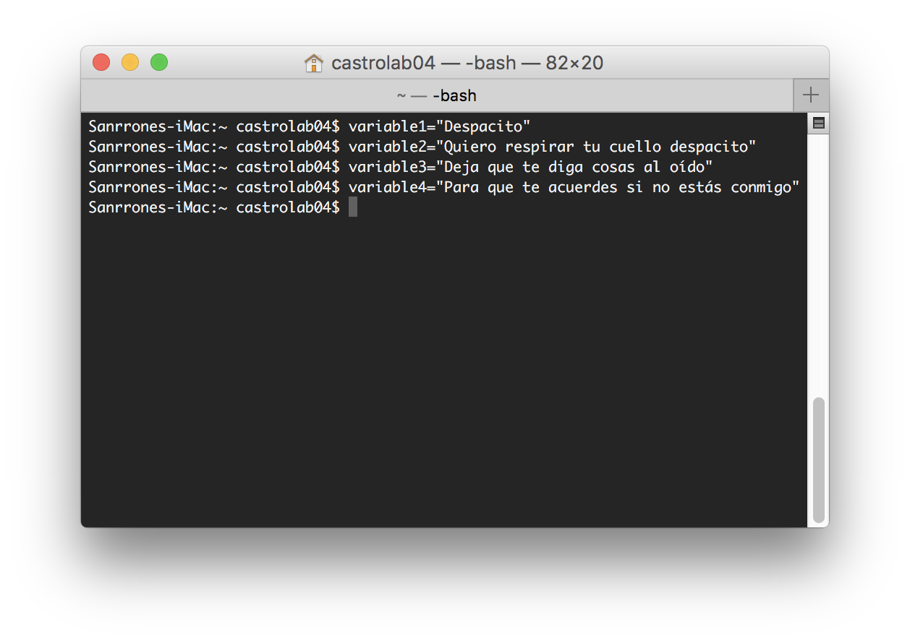
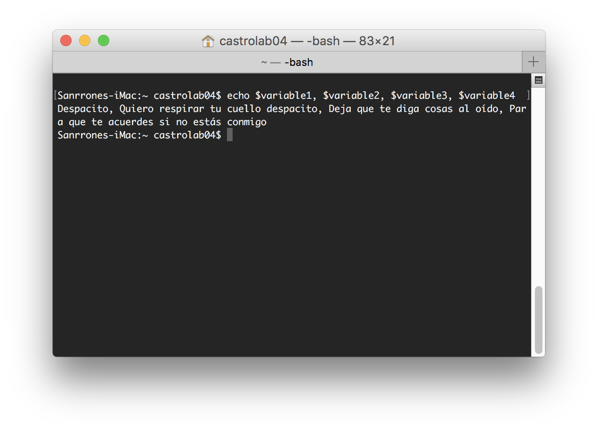

# Introducción a la Terminal y R.
--------
Hola!, bienvenidos al primer práctico de uso de terminal y R, aquí aprenderás los comandos esenciales usados en la terminal (o consola de comandos, o shell), y que son la base en el manejo de cualquier proyecto que tenga bioinformática en él. Así qué... manos a la obra!.

## ¿Que es una Terminal?

|	 | 	|  |  |
|:-:|:-:|:-:|:-:|
|Esta es una terminal| esta también es una terminal| Esto es la matrix, se hacen cosas parecidas en bioinformática, así que consideremos esta una terminal también| Esto es un ramsomware, el virus que atacó a Movistar hace unos días, hecho para windows, esto no es una terminal.|

Una terminal es un intérprete de comandos, fundamental en los sistemas operativos para la interacción con el usuario ya que se escriben comandos y acciones en el, esto también es considerado un lenguaje de programación. En este practico solo nos concentraremos en las terminales basadas en Unix (Linux o Mac, los siento Windows esta vez no).

## ¿Qué puedo hacer con la terminal?
Prácticamente todo lo que hace un computador, con una terminal tu ordenas lo que quieres y el computador lo hará, lo difícil es transmitir lo que realmente pensamos a la terminal.

## Primeras ordenes
Cuando se aprende un nuevo lenguaje de programación, lo tradicional es hacer que el computador nos diga "Hola Mundo" en dicho lenguaje de programación. Así que primer paso: Abrir una terminal como esta:

ahora usaremos el comando "echo" para que la terminal nos diga lo que queremos así que escribiremos: echo "Hola Mundo" y presionamos enter.

En realidad podemos decirle al computador que nos diga cualquier cosa con el comando echo, recuerda que cada vez que ingresas un comando o acción debes presionar enter.
## Variables
En la terminal podemos asignar frases completas (o números), a variables, y no nos referimos a variables matemáticas X e Y (podemos hacerlo, pero no es entretenido). **recuerda siempre poner tus variables dentro de comillas dobles**

y ahora en la misma terminal, podemos decirle al computador que nos muestre los párrafos con el comando echo y darle las variables como parámetro. **Cuando queremos hacer referencia a una variable la escribimos anteponiendo un "$"**: echo $variable1

Las variables pueden ahorrarnos mucho trabajo si queremos repetir frases para el futuro o guardar resultados de operaciones.
